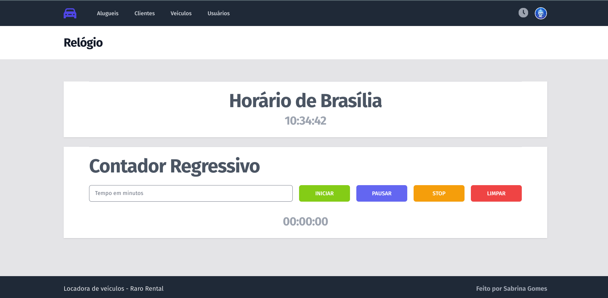

- [Admin Locadora RaroRental](#admin-locadora-rarorental)
  - [Objetivos](#objetivos)
    - [Atividade extra](#atividade-extra)
  - [Considerações importantes](#considerações-importantes)
    - [Formato de entrega](#formato-de-entrega)
    - [Resoluções dos problemas](#resoluções-dos-problemas)
      - [Gems](#gems)
      - [Design](#design)
      - [Validações](#validações)
      - [Campos de busca](#campos-de-busca)
      - [Usuário logado | Gestão de Usuários](#usuário-logado--gestão-de-usuários)
      - [Relógio - Atividade Extra](#relógio---atividade-extra)
    - [Desafios e dificuldades](#desafios-e-dificuldades)
    - [Pontos de melhoria](#pontos-de-melhoria)
  - [Instalação](#instalação)
    - [Acessos](#acessos)

# Admin Locadora RaroRental

Projeto iniciado durante a semana 6 da turma de Ruby on Rails - Raro Academy pelo professor Paulo Fernandes e continuado como exercício da semana citada, que teve "Introdução ao Rails" como tema.

## Objetivos

Tendo como base o [enunciado do exercício](./.gitlab/enunciado.md), os objetos são:

- [x] Retornar as mensagem de erro da partial `app/views/clientes/_form.html.erb`;
- [x] Garantir que todos os CRUDS tenham ações de `index`, `show`, `create`, `update` e `delete`;
- [x] Implementar design de todas as telas para que seja utilizável pelo usuário;
- [x] Alterar os alugueis para que eles permitam o cadastro dos seguintes campos:
  - data de inicio;
  - data fim;
  - valor a ser pago.
- [x] Ao clicar no avatar do usuário logado, o menu de contexto deve apresentar um link para editar os dados **do usuário logado**;
- [x] Implementar edição de todo o formulário do usuário logado com os campos:
  - nome;
  - email;
  - senha;
  - confirmação de senha;
  - foto (url para uma foto).
- [x] Implementar gestão de usuário com os seguintes requisitos:
  - CRUD de cadastro de usuários;
  - Validação de usuário credenciado e autenticado para acessar o sistema de administração.
- [x] Implementar campo de busca que permita o usuário operar em pelo menos um campo das entidades em todas as telas de listagem.

### Atividade extra

Como atividade extra foram solicitadas as seguintes correções no relógio criado pelo professor durante as aulas:

- [x] Garantir que o timer seja iniciado somente se houver um tempo informado;
- [x] Impedir que o usuário consiga iniciar o timer mais de uma vez;
- [x] Corrigir a ação de pausar para que o timer não seja reiniciado, mas retorne do ponto de onde parou;
- [x] Implementar a função do botão `limpar` do timer.

## Considerações importantes

### Formato de entrega

Conforme solicitado no enunciado do exercício, para cada funcionalidade foi criado um MR para a branch main com a descrição do que foi feito.
Seguindo a sugestão do professor, foram criadas issues para organização das tarefas e nomenclatura das branches.

Foi criado esse [template](./.gitlab/issue_templates/template.md) baseado no [artigo](https://www.pullrequest.com/blog/writing-a-great-pull-request-description/) compartilhado no enunciado para auxiliar na descrição do MR. A listagem das issues criadas pode ser visualizada [aqui](./.gitlab/issues.md). E abaixo pode ser visto como o board de issues foi utilizado.


### Resoluções dos problemas

#### Gems

- [Devise](https://github.com/heartcombo/devise) - Autenticação de usuários
- [Faker](https://github.com/faker-ruby/faker) - Geração de dados falsos
- [Ransack](https://activerecord-hackery.github.io) - Campos de busca

#### Design

O design das telas foi realizado utilizando as classes do [Tailwind](https://tailwindcss.com/). Abaixo está o resultado do design da tela de login e de cada etapa do CRUD (Create - telas para cadastros / Read - tabela com dados / Update - telas para edições / Delete - botões "delete")

- TELA DE LOGIN:


- **CADASTROS** DE CADA ENTIDADE:

<p align="center">
  
  
  
</p>

- TABELAS COM **DADOS** DE CADA ENTIDADE:

<p align="center">
  
  
  
</p>

- TELAS PARA **EDIÇÃO** DE CADA ENTIDADE:

<p align="center">
  
  
  
</p>

- TELAS PARA **VER** DADOS DETALHADOS:

<p align="center">
  
  
  
</p>

- ALERT GERADO PARA BOTÃO **DELETE**:


#### Validações

Foram criadas validações em todas as entidades, exceto para Usuário, que teve suas validações criadas a partir da gem Devise. As mesmas foram implementadas nos _models_, usando como base a própria documentação do [Rails](https://guiarails.com.br/active_record_validations.html).

#### Campos de busca

Ao acessar a documentação da gem Ransack são disponibilizados dois tipos de demonstração de como criar campos de busca, são eles: _simple_ e _advanced_. A implementação detalhada abaixo foi realizada seguindo a demonstração _simple_. A estilização foi realizada também com Tailwind.
É possível realizar buscas em todos os dados de cada entidade. Abaixo está o resultado da entidade Cliente, onde há um campo de busca para cada dado: nome, CPF e CNH.


#### Usuário logado | Gestão de Usuários

Para cumprir os requisitos dessa parte do exercício foram criados dois tipos de usuários: **usuário root** e **usuário padrão**. Ambos tem o menu de contexto, mas o usuário root tem acessos extras, enquanto o usuário padrão acessa apenas as funcionalidades das entidades: Cliente, Veiculo e Aluguel. Foi garantido o bloqueio a rota de _signup_, para que somente o usuário root possa criar novos usuários.

- Usuário Root:

  - Visualiza na _navbar_ um botão de acesso a todos usuários cadastrados;
  - Acessa rota que exibe o cadastro de um novo usuário.

- Navbar:


- TABELA USUÁRIOS | CADASTRO NOVO USUÁRIO:


- EDITAR PRÓPRIO USUÁRIO :


#### Relógio - Atividade Extra

Foi criada a rota `/relogio` para que ele saísse do `#index` da aplicação. Um ícone foi adicionado na `navbar`para que o mesmo possa ser acessado. Para os problemas do _timer_ foram implementadas as seguintes soluções:

1. Garantir que o timer seja iniciado somente se houver um tempo informado;
   - [x] Um alert é gerado na tela caso o usuário tente iniciar o timer com o _input_ vazio;
2. Impedir que o usuário consiga iniciar o timer mais de uma vez;

   - [x] Ao clicar no botão `iniciar` o mesmo é desabilitado e só volta a ficar habilitado quando o timer zera, além de alterar o cursor para `not-allowed`;

3. Corrigir a ação de pausar para que o timer não seja reiniciado, mas retorne do ponto de onde parou;

   - [x] Foi criado uma variável `rodando` que armazena o estado do nosso timer, se está rodando ou não. Ao clicar no botão `pausar`, verificamos o estado e caso `rodando` seja `true`, pausamos o timer e alteramos o estado para `false`. Armazena também a quantidade de milissegundos restante que capturamos ao converter o estado do mostrador para milissegundos. Ao clicar novamente no botão `pausar`, verificamos o estado e caso `rodando` seja `false`, iniciamos o timer com a quantidade de milissegundos restante e alteramos o estado para `true`. Foi necessário também desacoplar o método `rodaContador`;

4. Implementar a função do botão `limpar` do timer.

   - [x] O método `zerarContador` é chamado, ele é responsável por executar todos os comandos que fazem nosso contador voltar ao estado inicial de zerado.

Outras implementações também foram feitas:

- Diferente do botão _pause_, que quando é acionado para, mas pode retornar de onde parou, foi incluído o botão _stop_, que para, mas não pode ser retomado, guardando o valor do tempo até o contador ser zerado.

O resultado pode ser visualizado abaixo:



### Desafios e dificuldades

- Na implementação dos campos da entidade **Aluguel** houve dificuldades para manipular os dados do tipo _Date_ e _Float_, pois não foi possível definir nos seus respectivos _inputs_ o formato de data `DD/MM/YYYY` e o formato de moeda `BRL`. Para garantir o formato correto no _input_ de `valor_pago` foi tentado implementar uma validação com expressão regular (`validates :valor_pago, format: { with: /\A\d+(\.\d{0,2})?\z/ }`), mas não houve sucesso. Para amenizar esse _gap_ foram criados `helpers` que mostram as datas e os valores nos formatos desejados nas _views_. E no _input_ de `valor_pago` foi criado um _placeholder_ indicando o formato que deve ser preenchido.

<p align="center">
 
 
</p>

- No requisito **Formato de Entrega** foi encontrado o seguinte problema: para criar uma nova _branch_ através das _issues_, o botão _create branch_ não estava disponível. Pesquisando encontrei esse [link](https://stackoverflow.com/questions/73074590/gitlab-option-to-create-branch-from-the-issue-is-missing) que aponta ser necessário remover a relação com o _fork_. Fiz a remoção indicada e consegui realizar a criação de _branches_ normalmente.
  <br>
- No contexto de usuário o desafio foi entender o funcionamento do JavaScript juntamente com o Rails. Após algumas pesquisas e testes, descobri que a importação através do `application` funcionava apenas se não mudasse de tela, então importei também na _view_ do relógio. Nesse momento só funcionava após mudar de tela, descobri então que ele estava chamando duas vezes: uma por `application` e outra no contexto de usuário. A solução foi manter apenas a importação na _navbar_, _partial_ que armazena o menu de contexto de usuário.

### Pontos de melhoria

- Para o requisito **Gestão de Usuário** acredito que seria uma boa ideia adicionar ao **usuário root** a possibilidade de editar e deletar os usuários padrão. No momento, ele consegue apenas visualizá-los e gerar novos cadastros.

## Instalação

Antes de iniciar a aplicação é necessário a execução da seguinte sequência de comandos:

```bash
bundle install
yarn install
rails db:create
rails db:migrate
rails db:seed
```

Para iniciar o servidor recomenda-se a utilização do comando `./bin/dev`, pois ele garante que os assets serão todos devidamente processados.

### Acessos

- Usuário root: email: root@root.com, password: root@123
- Usuário padrão: email: paulo@raro.com, password: paulo@123
